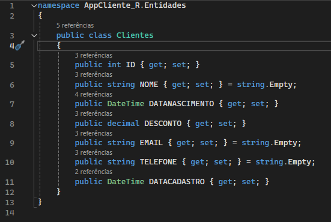
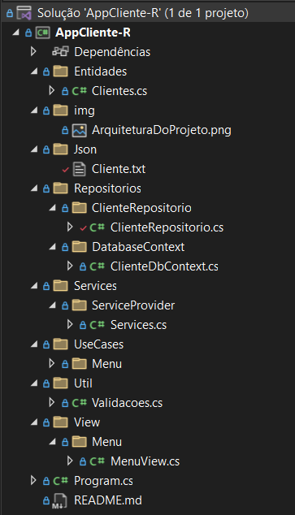
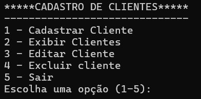
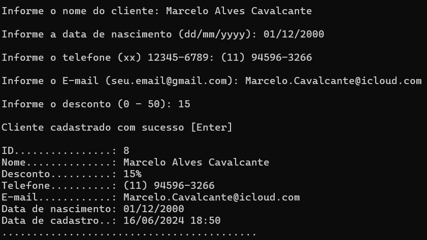
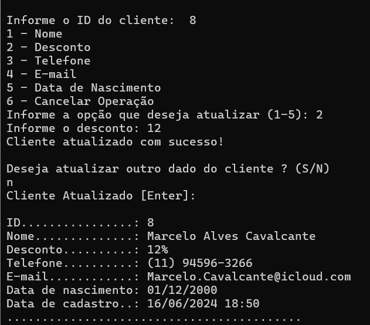
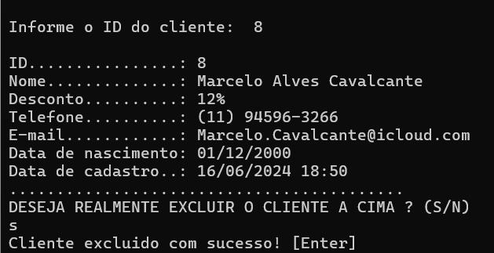
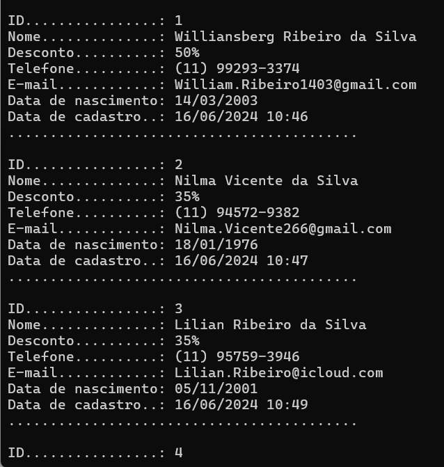
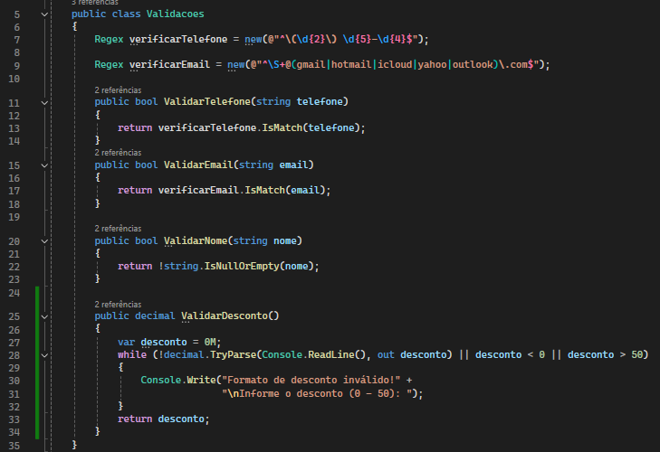
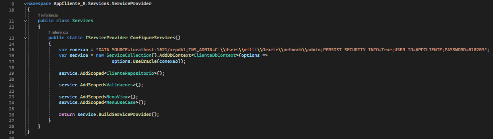

# Sistema de Cadastro de Clientes

Este é um projeto básico desenvolvido para exercitar conceitos de programação. O sistema permite o cadastro, edição, exclusão e exibição de clientes, com as seguintes propriedades:

- **Id**: Identificador único do cliente.
- **Nome**: Nome completo do cliente (obrigatório).
- **Data de Nascimento**: Data de nascimento do cliente no formato dd/mm/yyyy.
- **Telefone**: Número de telefone no formato (12) 12345-6789.
- **Email**: Endereço de email no formato seu.email@odominio.com.
- **Desconto**: Valor de desconto aplicável ao cliente, não pode ser menor que 0 nem maior que 50.
- **Data de Cadastro**: Data e hora em que o cliente foi cadastrado (DateTime.Now).

  

    
  

## Estrutura do Projeto
- **Entidades**: Contém a classe `Cliente`, uma entidades do banco de dados.
- **Json**: Armazena dados de clientes serializados em formato JSON.
- **Repositórios**:
  - **clienteRepositorio**: Repositório para operações da entidade `Cliente`.
  - **DatabaseContext**: Gerencia o contexto do banco de dados (`ClienteDbContext`).
- **Services**:
  - **ServiceProvider**: Gerencia serviços de injeção de dependência.
- **View**:
  - **Menu**: Fornece a interface do usuário para aplicações de console.
- **Use Case**:
  - **Menu**: Executa casos de uso da aplicação.
- **Util**: Inclui serviços para validação de dados (`Validacoes`).

    

    
## Funcionalidades

### Menu
Mostra no console o menu com todas as funcionalidades do sistema.

    

### 1. Cadastrar Cliente
Permite o cadastro de um novo cliente com validações para as propriedades mencionadas.

    

### 2. Editar Cliente
Permite a edição dos dados de um cliente existente, com validações específicas para cada propriedade.

    

### 3. Excluir Cliente
Remove um cliente da base de dados.

    

### 4. Exibir Todos os Clientes
Lista todos os clientes cadastrados no sistema, informando todos os seus respectivos dados.

    

## Normas de Validação

- **Nome**: Deve ser informado e não pode ser nulo.
- **Data de Nascimento**: Deve ser fornecida no formato dd/mm/yyyy.
- **Telefone**: Deve estar no formato (12) 12345-6789.
- **Email**: Deve estar no formato seu.email@odominio.com.
- **Desconto**: Deve estar entre 0 e 50.
- **Data de Cadastro**: É automaticamente definida como DateTime.Now no momento do cadastro.

    

## Injeção de Dependência

No projeto `AppCliente_R`, utilizamos a injeção de dependência para gerenciar as dependências entre os objetos e o banco. Isso é feito através da classe `Services`, que configura os serviços necessários e os disponibiliza para o resto da aplicação.

    

#
Este projeto foi desenvolvido como exercício para práticas em programação e manipulação de dados. Qualquer dúvida ou sugestão, sinta-se à vontade para entrar em contato!
